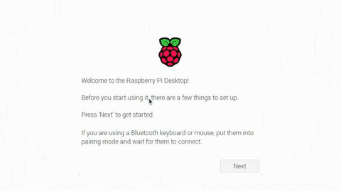

# Initial Raspberry Pi Setup

[Go back to README](/README.md)

## Step 1: First boot

- Country
- Username & Password
- Wifi
- Update

## Step 2: Change keyboard layout

## Step 3: Enable SSH & Camera

### Raspberry Pi Configuration

- `sudo raspi-config`

### Example Commands

- 'raspivid --help'
- 'raspistill --help'
- 'raspistill -o image.jpg'

