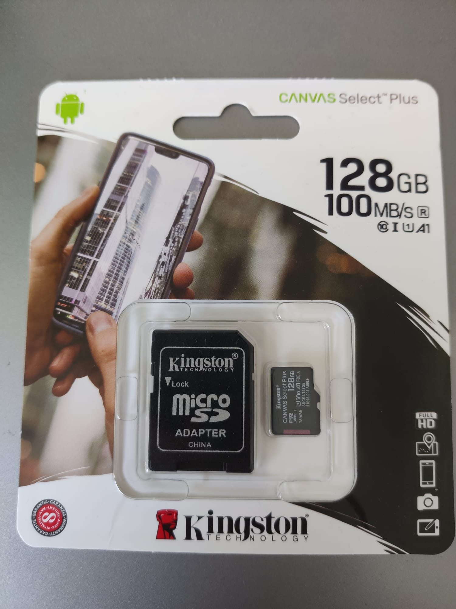
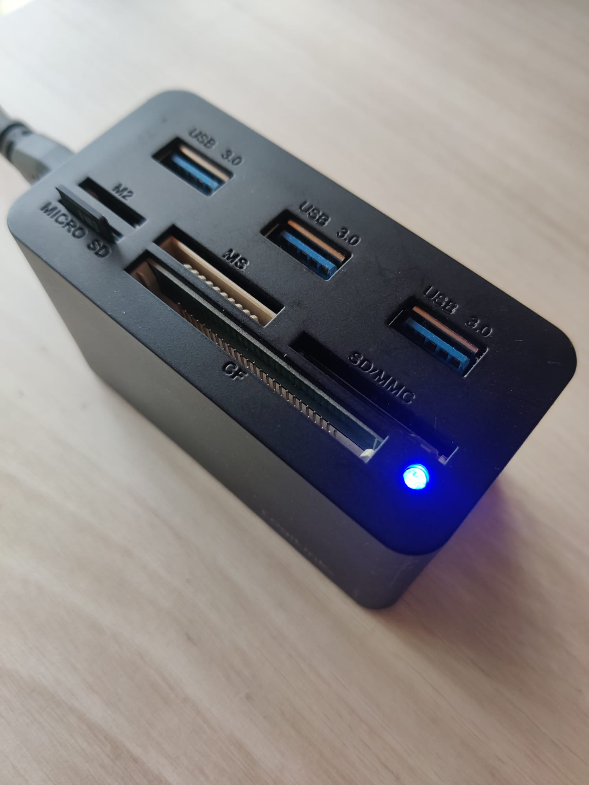
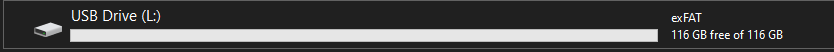
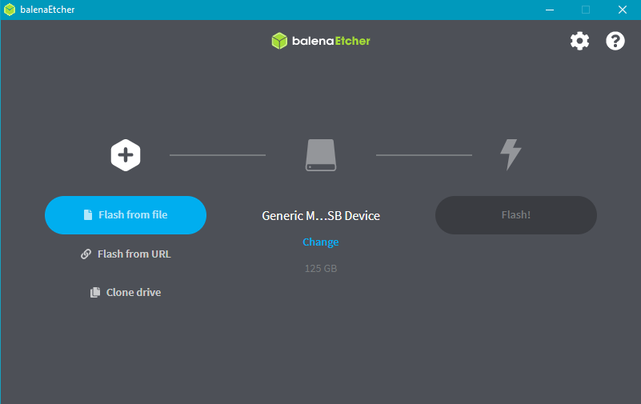
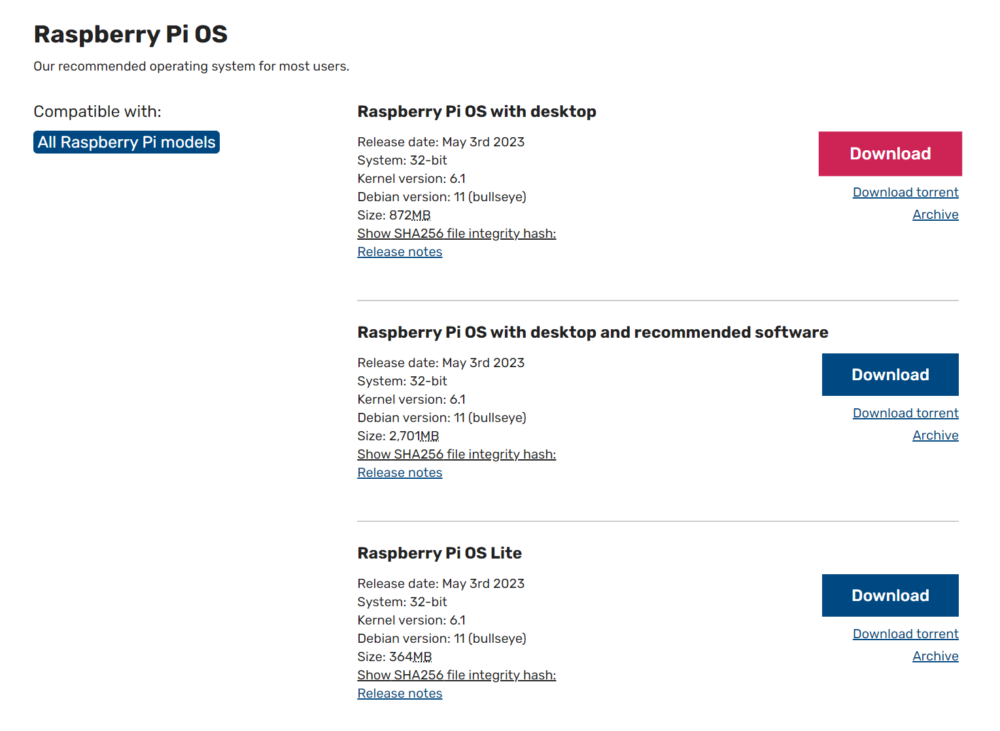
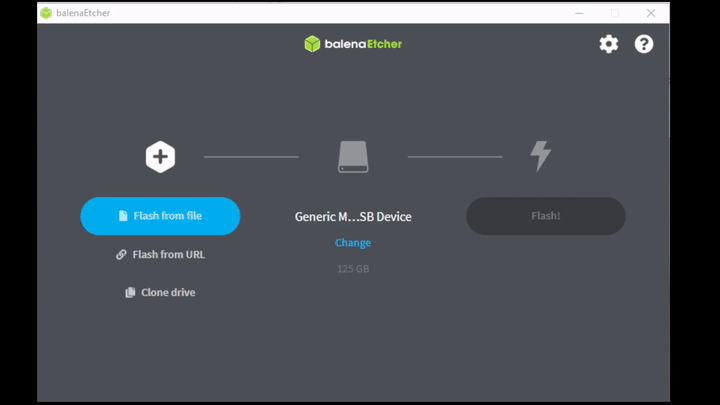

# Installing Raspian on raspberry pi

## Step 1 Insert SD Card in computer

<!-- show image of SD card from images/sdcard.jpeg -->
<!--  -->

Plug into reader

Look for letter in file explorer (mine is L:)

## Step 2 Download & install [BalenaEtcher](https://etcher.balena.io/)

Or [Rasberry Pi Imager ](https://www.raspberrypi.com/software/) or another imager.

## Step 3 Download [Raspian OS](https://www.raspberrypi.com/software/operating-systems/)

Pick any os you want to install, I picked Raspberry Pi OS with desktop.

## Step 4 Flash SD Card with Raspian OS

## Step 5 Plug in everything

- USB (Mouse & Keyboard)
- HDMI (Screen)
- Power
- SD Card
- Camera

